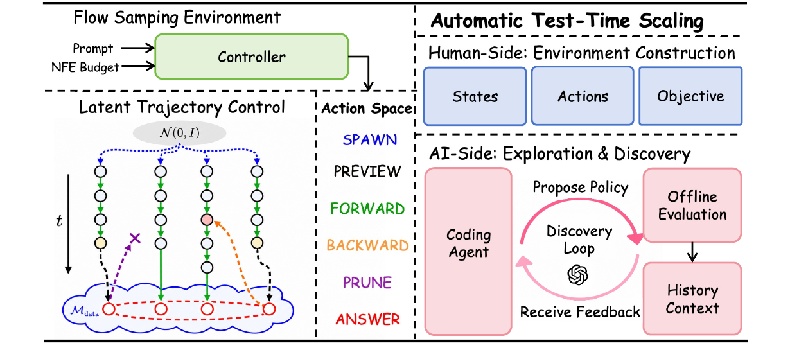
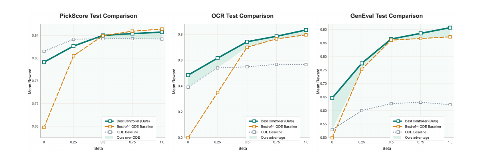

# FlowAutoTTS: Automatic Test-Time Scaling for Flow-Matching Samplers

**[📄 Report (PDF)](docs/report.pdf)** · **[Controller spec](docs/controller_spec.md)**

FlowAutoTTS is an agentic framework that **automatically discovers test-time scaling (TTS)
controllers for flow-matching samplers**. Rather than hand-design a sampler such as best-of-N,
noise re-injection or stochastic branching, we treat flow-matching inference as a
**control problem over latent trajectories**. We expose it as a small, budgeted sampling
environment and let an LLM coding agent evolve controller programs that push the
**reward–NFE Pareto frontier** forward.



<sub>A controller acts on latent trajectories through six primitive actions. A coding agent
proposes controller programs, evaluates them offline under several NFE budgets, and uses the
evaluation history as context for the next proposal.</sub>

## Highlights

- **One action space for many TTS methods.** Best-of-N, predict-and-perturb self-refinement
  and prune-and-branch search can each be written as a short program over
  `SPAWN / FORWARD / PREVIEW / BACKWARD / PRUNE / ANSWER`.
- **One budget knob.** Each controller is a single program conditioned on `beta ∈ [0, 1]`,
  which maps to an NFE budget. It is scored on the whole reward–budget curve, not one point.
- **Fully automatic evolution.** Every round, an explorer agent (OpenAI Codex CLI) rewrites
  the controller, a harness evaluates it on Stable Diffusion 3.5 Medium, and compact
  summaries feed the next round.
- **Better frontiers in 5 rounds.** On PickScore, OCR and GenEval, the evolved controllers
  match or beat deterministic Euler sampling and best-of-4 selection across budgets. The
  gains are largest on OCR and GenEval.

## Method

### Latent-trajectory environment

Time runs from `t = 0` (noise) to `t = 1` (data) along the rectified-flow path
`z_t = (1 − t)·z_0 + t·z_1`. A controller only sees a public state: remaining budget,
particle summaries, preview scores and an event log. It never sees raw latents. It acts
through these actions:

| Action     | NFE cost        | Effect |
| ---------- | --------------- | ------ |
| `SPAWN`    | 0               | Create `n` new particles from the prior `N(0, I)` (widen the search). |
| `FORWARD`  | 1 per step      | Integrate a particle to a later time with an ODE (Euler) or SDE solver. |
| `PREVIEW`  | 1               | Predict a clean anchor `ẑ₁ = z + (1−t)·u` and a noise anchor `ẑ₀ = z − t·u`, then decode and score `ẑ₁` with the reward model. |
| `BACKWARD` | 0               | Re-noise a preview anchor to an earlier time with *fresh*, *inferred* or *mixed* noise, creating child particles (local refinement / branching). |
| `PRUNE`    | 0               | Drop weak active particles. |
| `ANSWER`   | 0 (+ finishing) | End the episode and return the best-previewed anchor or the latest active particle. |

Any action that would exceed the budget raises `BudgetExceededError`, so every controller stays within
its NFE allowance.

### Automatic controller evolution

A controller `π(· | s, β)` produces a reward curve `F_π(β)` over budgets. The explorer
maximizes the weighted area under that curve, a practical surrogate for minimizing regret
to the ideal frontier, evaluated on a fixed grid

```
β ∈ {0, 0.25, 0.5, 0.75, 1.0}  ↦  NFE ∈ {10, 20, 36, 48, 64}
```

Each workflow round:

1. resets `flow_autotts/controllers/optimal.py` from `optimal.template.py`;
2. builds a **context pack** containing the spec, the baselines, a frontier comparison table and
   compact summaries of recent rounds;
3. runs the explorer agent, which may edit **only** `optimal.py`;
4. evaluates the new controller on the training prompts at every `β`;
5. archives the controller snapshot, the summary and the full history, then starts the next round.

## Results

Evolution ran for 5 rounds on 500 training prompts per benchmark, with SD3.5 Medium as the base
model and GPT-5.4-thinking as the explorer. Baselines are a deterministic FlowMatch
Euler sampler (depth only) and best-of-4 selection (width only).



<sub>Test-set reward vs. budget for the best evolved controller, the Euler (ODE) baseline and
best-of-4.</sub>

**Training-set reward (×100) by evolution round**

| Method    | PickScore β=0 | .25 | .5 | .75 | 1.0 | OCR β=0 | .25 | .5 | .75 | 1.0 | GenEval β=0 | .25 | .5 | .75 | 1.0 |
| --------- | ---: | ---: | ---: | ---: | ---: | ---: | ---: | ---: | ---: | ---: | ---: | ---: | ---: | ---: | ---: |
| Euler     | 80.94 | 82.83 | 82.94 | 82.92 | 82.94 | 39.67 | 55.13 | 55.76 | 57.85 | 57.38 | 48.82 | 52.87 | 54.93 | 56.52 | 56.78 |
| Best-of-4 | 67.65 | 80.21 | 83.66 | 84.40 | 84.73 | 0.02 | 35.68 | 70.69 | 76.10 | 81.83 | 1.20 | 67.32 | 80.47 | 79.65 | 81.18 |
| Round 0   | 77.81 | 78.97 | 83.90 | 84.16 | 84.46 | 35.81 | 59.20 | 70.18 | 77.65 | 80.71 | 29.87 | 61.87 | 76.88 | 80.32 | 82.48 |
| Round 4   | 78.80 | 81.79 | 83.74 | 84.01 | 84.30 | 47.67 | 61.60 | 75.17 | 78.75 | 83.15 | 55.72 | 68.42 | 78.67 | 81.28 | **84.40** |

On OCR, round 4 beats round 0 at every budget, for example 35.81 → 47.67 at β=0. On GenEval
it gains most at low budgets. PickScore is close to saturated once β ≥ 0.5. Per-round numbers,
test-set curves and discussion are in the [report](docs/report.pdf).

## Repository layout

```text
flow_autotts/
├── core/                    # environment & public state
│   ├── episode.py           #   shared budget / event-log / PRUNE bookkeeping
│   ├── env.py               #   FlowTTSEnv over plain float vectors (toy & tests)
│   ├── state.py             #   records visible to controllers
│   └── trajectory.py        #   private latent stores (never exposed)
├── controllers/
│   ├── baselines.py         # deterministic, best-of-N, SDE, self-refine, prism-style
│   ├── optimal.template.py  # starting point reset before every round
│   └── optimal.py           # controller rewritten by the explorer agent
├── eval/                    # metrics, beta sweeps, Pareto frontier, round summaries
├── experiments/
│   ├── eight_gaussians/     # CPU-only 2D toy flow for quick sanity checks
│   └── pickscore_sd35/      # SD3.5 Medium + PickScore environment, harness, multi-GPU eval
└── workflow/                # propose → evaluate → archive loop around the Codex CLI
docs/
├── report.pdf               # project report
└── controller_spec.md       # full environment / controller specification
tests/                       # unit tests (no GPU required)
```

This repository contains the PickScore pipeline. You can target another benchmark, such as
OCR or GenEval, by swapping the reward model in
`experiments/pickscore_sd35/scoring.py`.

## Installation

The project uses [uv](https://docs.astral.sh/uv/) and requires Python ≥ 3.11.

```bash
git clone https://github.com/lan-kehan/FlowEvo.git
cd FlowEvo
uv sync --group dev                 # core library + tests (CPU only)
uv sync --group dev --group sd35    # + torch / diffusers / transformers for SD3.5
```

The evolution workflow also needs the OpenAI Codex CLI (Node ≥ 18):

```bash
npm install -g @openai/codex
codex exec --help
```

## Quick start (CPU)

Run the tests and a controller sweep on the 2D eight-Gaussians toy flow. Neither needs a
GPU or model weights:

```bash
uv run python -m pytest
uv run python -m flow_autotts.experiments.eight_gaussians.harness \
    --controller prism --betas 0 0.5 1.0 --seeds 0 1 2 3
```

## Running on SD3.5 Medium + PickScore

### 1. Models and prompts

```bash
huggingface-cli login
huggingface-cli download stabilityai/stable-diffusion-3.5-medium --local-dir SD_3.5_med
huggingface-cli download yuvalkirstain/PickScore_v1 --local-dir PickScore_v1
```

Prompt files hold one prompt per line, as `train.txt` and `test.txt`. By default they are read
from `flow_grpo/dataset/pickscore/`. Copy them from the
[Flow-GRPO](https://github.com/yifan123/flow_grpo) repository's `dataset/pickscore/`, or point
`FLOW_TTS_DATASET` at your own directory.

### 2. Evaluate a controller

```bash
uv run --group sd35 python -m flow_autotts.experiments.pickscore_sd35.harness \
    --controllers best_of_n --rounds 1 --sample-size 100 \
    --betas 0 0.25 0.5 0.75 1.0 --budget 64 \
    --output logs/flow_autotts/pickscore_sd35/best_of_n/history.json
```

To shard the prompts across GPUs, use `flow_autotts.experiments.pickscore_sd35.parallel_eval
--devices cuda:0,cuda:1,...`.

### 3. Run the evolution workflow

This example runs 5 rounds with 4 GPUs, 500 training prompts and 5 budget levels:

```bash
RUN_TAG="autotts_$(date +%Y%m%d_%H%M%S)"
LOG_ROOT="$PWD/logs/flow_autotts/pickscore_sd35"
mkdir -p "$LOG_ROOT/manual_runs"

nohup env \
  FLOW_TTS_PROMPT_PROFILE=autotts \
  FLOW_TTS_EVAL_DEVICES="cuda:0,cuda:1,cuda:2,cuda:3" \
  FLOW_TTS_SPLIT=train FLOW_TTS_SAMPLE_SIZE=500 FLOW_TTS_SAMPLE_SEED=42 \
  FLOW_TTS_BETAS="0 0.25 0.5 0.75 1.0" FLOW_TTS_BUDGET=64 FLOW_TTS_NUM_STEPS=10 \
  WORKFLOW_RESUME=0 WORKFLOW_ROUNDS=5 WORKFLOW_CONTEXT_HISTORY_ROUNDS=5 \
  WORKFLOW_HISTORY_DIR="logs/flow_autotts/pickscore_sd35/history_${RUN_TAG}" \
  WORKFLOW_CODEX_LOG_PARENT="$LOG_ROOT/codex_logs_${RUN_TAG}" \
  WORKFLOW_RESULT_DIR="$LOG_ROOT/training_results_${RUN_TAG}" \
  CODEX_EXEC_ARGS="--dangerously-bypass-approvals-and-sandbox" \
  uv run --group sd35 bash flow_autotts/experiments/pickscore_sd35/run_workflow.sh \
  > "$LOG_ROOT/manual_runs/${RUN_TAG}.log" 2>&1 &

tail -f "$LOG_ROOT/manual_runs/${RUN_TAG}.log"
```

`CODEX_EXEC_ARGS="--dangerously-bypass-approvals-and-sandbox"` is required only where the Codex
sandbox is unavailable, such as inside containers. Use it on isolated machines only. Every
option is configurable through environment variables. See
[`run_workflow.sh`](flow_autotts/experiments/pickscore_sd35/run_workflow.sh) for the full list.

### 4. Reading the outputs

Each round is archived under `WORKFLOW_HISTORY_DIR/rXXXX_<timestamp>_<id>/`:

| File | Contents |
| ---- | -------- |
| `flow_autotts/controllers/optimal.py` | Snapshot of the controller proposed this round. |
| `proposal_results/summary.json` | Compact feedback for the explorer: reward / NFE / reward-per-NFE per `β`, Pareto frontier, mean action counts and a one-line behavior summary. |
| `proposal_results/history.json` | Full evaluation log, including per-prompt event traces (large). |

## Acknowledgements

This work builds on [Stable Diffusion 3.5](https://huggingface.co/stabilityai/stable-diffusion-3.5-medium),
[PickScore](https://github.com/yuvalkirstain/PickScore) and
[Flow-GRPO](https://github.com/yifan123/flow_grpo). It is inspired by AutoTTS-style
environment-driven controller discovery for language models and by LLM-driven algorithm
discovery such as FunSearch, AlphaEvolve and Evolution of Heuristics.
